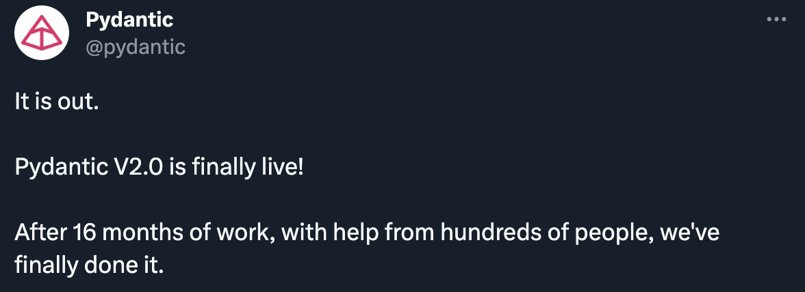
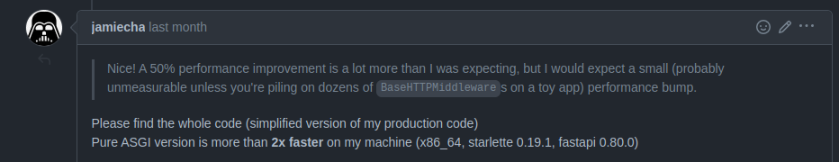

## Performance Tips by the FastAPI Expert

Marcelo Trylesinski

---

# Who am I?

---

---

# OSS Maintainer

## Uvicorn

## Starlette

---

# Software Engineer @

---

# Try Pydantic V2!

---

# Data people, help us!

[pydantic.dev/roadmap](https://pydantic.dev/roadmap/)

---

## Performance Tips

---

## Simple Application

---

## Simple Application

---

## Simple Application

https://json-generator.com/

https://jsontopydantic.com/

---

## Use uvloop

---

## Use uvloop

Improvement of **~10%**

---

### Use uvloop

---

### Use httptools

Python binding for the nodejs HTTP parser

---

### Use httptools

Improvement of **~10%**

---

### Use httptools

---

### Bigger Threadpool

---

### Bigger Threadpool

Improvement of **~5%**

---

### Simple Async Application

---

### Simple Async Application

Improvement of **~15%**

---

### Duplicated validation

---

### Duplicated validation

Improvement of **~25%**

---

### Use ORJSON

---

### Use ORJSON

Improvement of **~5%**

---

### Without Validation

---

### Without Validation

Improvement of **~150%**

---

### Without Logging

---

### Without Logging

Improvement of **~15%**

---

### Without any of the previous improvements...

Using Pydantic V2...

---

Improvement of **~265%**

---

### Bonus: Use ASGI Middleware

---

### Bonus: Use ASGI Middleware

---

### Bonus: Use ASGI Middleware

---

### Bonus: Use ASGI Middleware

Read about **ASGI Pure Middleware** on:

https://www.starlette.io/middleware/

---

### Bonus: Compressing Responses

---

# Thank You!

## Questions?

<link rel="stylesheet" href="https://cdnjs.cloudflare.com/ajax/libs/font-awesome/5.15.3/css/all.min.css" integrity="sha512-iBBXm8fW90+nuLcSKlbmrPcLa0OT92xO1BIsZ+ywDWZCvqsWgccV3gFoRBv0z+8dLJgyAHIhR35VZc2oM/gI1w==" crossorigin="anonymous" referrerpolicy="no-referrer" />

<i class="fab fa-linkedin"></i> Marcelo Trylesinski
<i class="fab fa-twitter"></i> @marcelotryle
<i class="fab fa-github"></i> Kludex

<i class="fas fa-heart"></i> github.com/sponsors/Kludex
