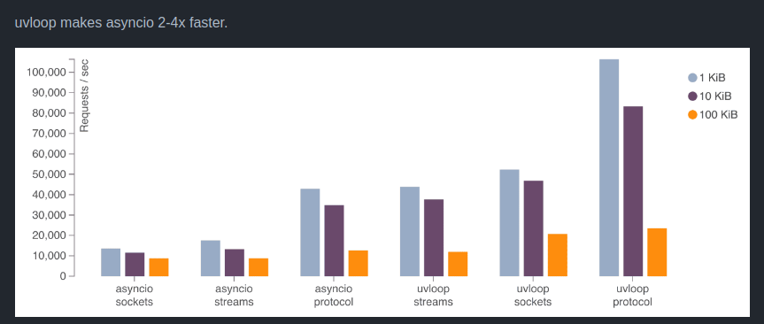

## Performance Tips with the FastAPI Expert

Marcelo Trylesinski

---

# About me

---

## FastAPI Expert

---

## OSS Maintainer

### Uvicorn

### Starlette

---

## Performance Tips

---

## Simple Application

---

## Simple Application

https://json-generator.com/

https://jsontopydantic.com/

---

## Simple Application

# requests | req/s
--- | ---
9990 | 334.37

---

## Use uvloop

---

## Use uvloop

### Simple App

# requests | req/s
--- | ---
9990 | 334.37

### Simple App + uvloop

# requests | req/s
--- | ---
11256 | 376.71

### **~12%**

---

### Use uvloop

---

### Use httptools

Python binding for the nodejs HTTP parser

---

### Use httptools

### Simple App

# requests | req/s
--- | ---
9990 | 334.37

### Simple App + httptools

# requests | req/s
--- | ---
11040 | 369.32

### **~10%**

---

### Use httptools

---

### Bigger Threadpool

---

### Bigger Threadpool

### Simple App

# requests | req/s
--- | ---
9990 | 334.37

### Increasing Threadpool

# requests | req/s
--- | ---
11014 | 368.44

### **~10%**

---

### Simple Async Application

---

### Simple Async Application

### Simple App

# requests | req/s
--- | ---
9990 | 334.37

### Simple Async App

# requests | req/s
--- | ---
11470 | 383.72

### **~15%**

---

### Duplicated validation

---

### Duplicated validation

### Simple App

# requests | req/s
--- | ---
9990 | 334.37

### Single Validation

# requests | req/s
--- | ---
13449 | 449.90

### **~35%**

---

### Use ORJSON

---

### Use ORJSON

### Simple App

# requests | req/s
--- | ---
9990 | 334.37

### Using ORJSON

# requests | req/s
--- | ---
14441 | 483.09

### **~45%**

---

### Without Validation

---

### Without Validation

### Simple App

# requests | req/s
--- | ---
9990 | 334.37

### Without Validation

# requests | req/s
--- | ---
28664 | 958.86

### **~187%**

---

### Without Logging

---

### Without Logging

### Simple App

# requests | req/s
--- | ---
9990 | 334.37

### Without Logging

# requests | req/s
--- | ---
10884 | 364.12

### **~9%**

---

### Bonus: Use ASGI Middleware

---

### Bonus: Use ASGI Middleware

---

### Bonus: Use ASGI Middleware

---

### Bonus: Use ASGI Middleware

Read about **ASGI Pure Middleware** on:

https://www.starlette.io/middleware/

---

### Bonus: Compressing Responses

---

# Thank You!

## Questions?

<link rel="stylesheet" href="https://cdnjs.cloudflare.com/ajax/libs/font-awesome/5.15.3/css/all.min.css" integrity="sha512-iBBXm8fW90+nuLcSKlbmrPcLa0OT92xO1BIsZ+ywDWZCvqsWgccV3gFoRBv0z+8dLJgyAHIhR35VZc2oM/gI1w==" crossorigin="anonymous" referrerpolicy="no-referrer" />

<i class="fab fa-linkedin"></i> Marcelo Trylesinski
<i class="fab fa-twitter"></i> @marcelotryle
<i class="fab fa-github"></i> Kludex

<i class="fas fa-heart"></i> github.com/sponsors/Kludex
